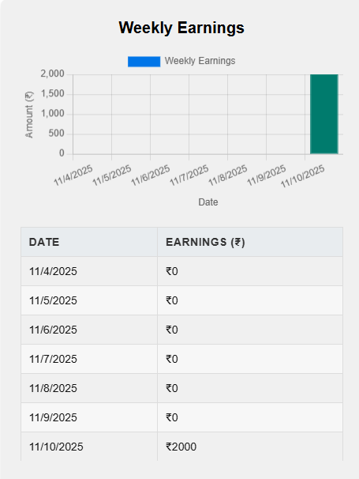
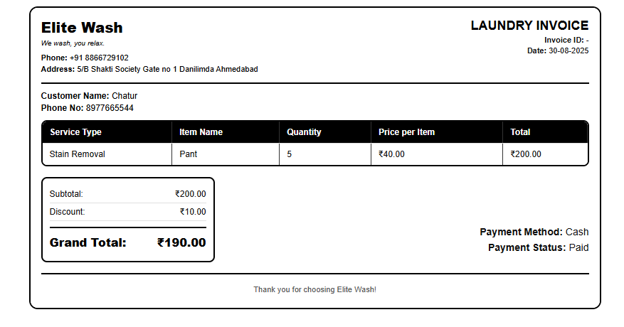
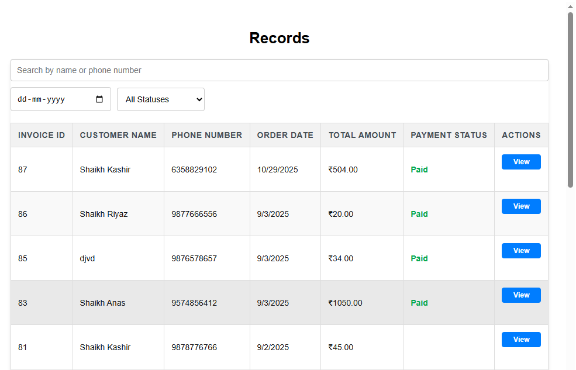
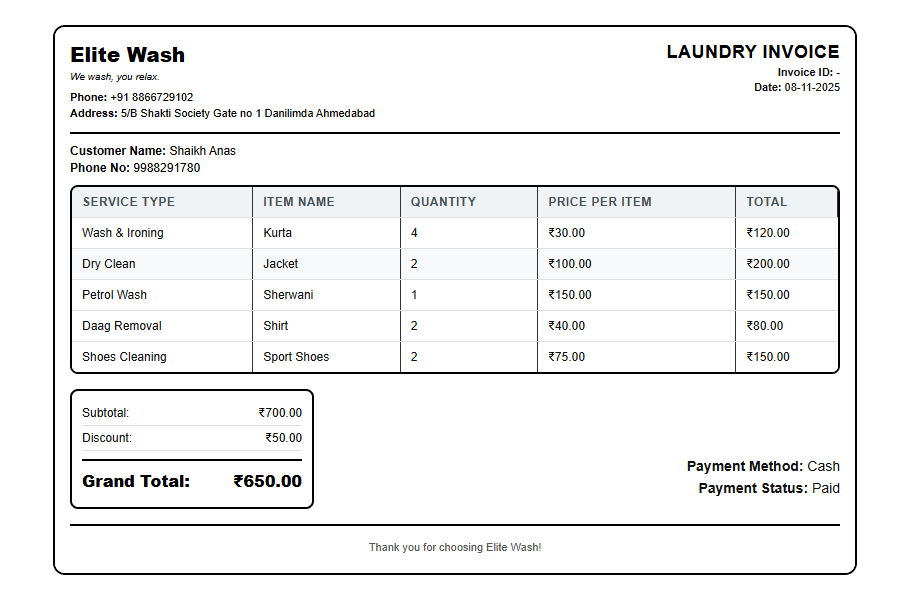
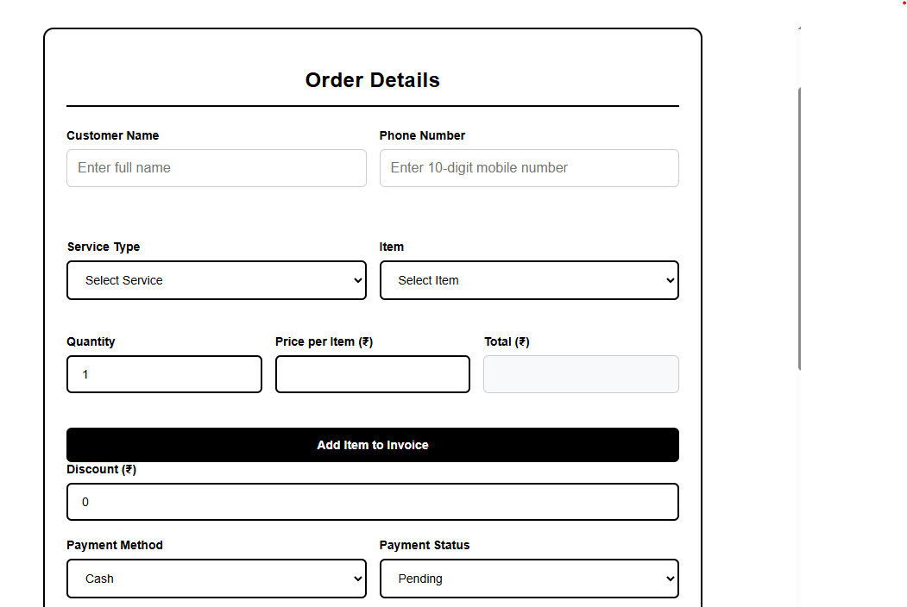
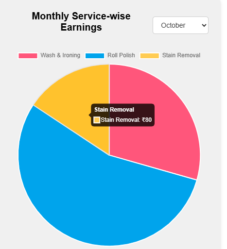
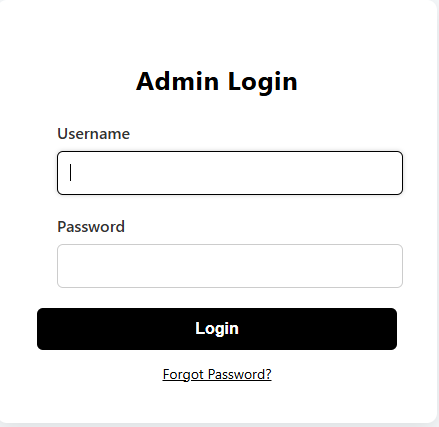

# 🧺 Laundry POS

A desktop-based **Laundry Management & Billing System** built to help laundry shop owners manage billing, services, customers, employees, records, and revenue from one application.

## ✨ Features

* 📊 **Dashboard** — Overview of business activity and revenue
* 🧾 **Billing** — Create bills with multiple services/items
* 🖨️ **Print Bill** — Generate and print customer bills
* 📋 **Records** — View and manage previous bills and transactions
* 💰 **Revenue Reports** — View revenue based on service categories
* 👨‍💼 **Employee Management** — Add, update and manage employee data
* 🧺 **Service Management** — Add new services and items
* 💵 **Flexible Pricing** — Set or change item prices directly while creating a bill
* 👤 **Customer Management** — Store customer information for billing
* ✅ **Validations** — Input validation to prevent incorrect billing data
* 🖥️ **Desktop Application** — Designed for Windows-based laundry shops

## 🛠️ Tech Stack

* **HTML5**
* **CSS3**
* **JavaScript**
* **Electron.js** — Desktop application
* **PostgreSQL** — Database

## 🔄 Workflow

```text
Customer
   ↓
Select / Add Services
   ↓
Set Quantity & Price
   ↓
Create Bill
   ↓
Print Bill
   ↓
Save Record
   ↓
Dashboard & Revenue
```

## 🗄️ Database

The application uses **PostgreSQL** to store:

* Customers
* Bills & bill items
* Services
* Employees
* Business records
* Revenue-related data

## 🚀 Future Enhancements

* 📱 Customer SMS/WhatsApp notifications
* 📈 Advanced revenue and business analytics
* 🔐 Multiple user/employee login roles
* ☁️ Cloud database & backup
* 📦 Order status tracking
* 🧾 Invoice customization
* 🔄 Automatic database backup

## 📸 Screenshots

### Dashboard

<p align="center">
  
</p>

### Billing

<p align="center">
  
</p>

### Records

<p align="center">
  
</p>

### Employee Management

<p align="center">
  
</p>

### Revenue

<p align="center">
  
  
  
  
  
  
  
</p>

---

<p align="center">
  Built with  using Electron.js & PostgreSQL
</p>
